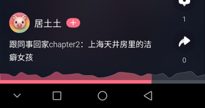

产品提了个需求：播放器中增加弹幕热力图

问视觉小哥：曲线是怎么画出来的

视觉：用手画出来的

好像也没说错？是我高估了他的脚吗

<!---more--->

最近 Flutter 使用得比之前熟练了一些，接了一个看起来比较有意思的需求：

### 一. 需求内容

在播放器中增加弹幕热力图组件 （在进度条上方绘制一条根据对应时间弹幕数量多少的有颜色曲线，并将其与进度条区域填充，已播放区域的颜色为激活态颜色）

### 二. 方案设计

前期的讨论与数据处理方式就不赘述了，结果是拿到最多50段时间对应的弹幕数，我们将其定义为关键点，也就说目前已经拿到了最多50个关键点的坐标，接下来说重点部分，也就是热力图的绘制，一开始想了三种实现方式：

- 引入第三方库
- 将曲线拆解到点的级别，每两个点连线
- 自定义View （CustomPaint）

关于引入第三方库的方式

- 发现了一个 flutter_chart 这个开源库，支持这样的[现实效果](https://google.github.io/charts/flutter/gallery.html)，
- 接入过程中发现该库是针对静态图表设计的，进度动态变化的需求无法完成，且该库不支持曲线
- 该库功能庞大，引入会有很多无用代码

关于拆解到点级别的方式

- 将曲线拆解为像素，这样就都是直线
- 绘制曲线上每个像素点到底部进度条对应点的线即可  

因为这种方式也有很明显的弊端：对性能开销较大，因此选用自定义 View 的方式

### 三. 实现过程

- Flutter也支持自定义 View，是通过 CustomPaint + 自定义画笔 Painter 来实现的（目前这类资料较少，这也是一开始考虑使用谷歌提供图表库的原因之一）  
- 曲线通过关键点 + 三阶贝塞尔曲线、使用类似于差值器的思想完成
- 进度由播放器统一控制（即播放器控制进度条与热力图各自的进度）  

#### 0. 效果图

这里就不列出视觉稿了，实现效果如下，大概也就能理解需求是什么了吧




#### 1. 曲线的绘制

我们知道贝塞尔曲线是一种比较优雅的曲线，这里为了节省时间，不和视觉小哥解释，直接使用[三阶贝塞尔曲线](https://en.wikipedia.org/wiki/Cubic_Hermite_spline#Representations)

```dart
/// 三阶贝塞尔曲线
class CubicBezierMonet {
  static Path _point(Path path, double x0, double y0, double x1, double y1,
      double t0, double t1) {
    double dx = (x1 - x0) / 3 ?? 0;
    path.cubicTo(x0 + dx, y0 + dx * t0, x1 - dx, y1 - dx * t1, x1, y1);
    return path;
  }

  static Path addCurve(Path path, List<Point> points, {bool reversed = false}) {
    var targetPoints = List<Point>();
    targetPoints.addAll(points);
    targetPoints.add(Point(
        points[points.length - 1].x * 2, points[points.length - 1].y * 2));
    double x0, y0, x1, y1, t0;
    if (path == null) {
      path = Path();
    }
    List<List<double>> arr = [];
    for (int i = 0; i < targetPoints.length; i++) {
      double t1;
      double x = targetPoints[i].x.toDouble();
      double y = targetPoints[i].y.toDouble();
      if (x == x1 && y == y1) continue;
      switch (i) {
        case 0:
          break;
        case 1:
          break;
        case 2:
          t1 = _slope3(x0, y0, x1, y1, x, y);
          arr.add([x0, y0, x1, y1, _slope2(x0, y0, x1, y1, t1), t1]);
          break;
        default:
          t1 = _slope3(x0, y0, x1, y1, x, y);
          arr.add([x0, y0, x1, y1, t0, t1]);
      }
      x0 = x1;
      y0 = y1;
      x1 = x;
      y1 = y;
      t0 = t1;
    }
    if (reversed) {
      arr.reversed.forEach((f) {
        _point(path, f[2], f[3], f[0], f[1], f[5], f[4]);
      });
    } else {
      arr.forEach((f) {
        _point(path, f[0], f[1], f[2], f[3], f[4], f[5]);
      });
    }
    return path;
  }

  static num _sign(num x) {
    return x < 0 ? -1 : 1;
  }

  // Calculate a one-sided slope.
  static double _slope2(double x0, double y0, double x1, double y1, double t) {
    var h = x1 - x0;
    return h != 0 ? (3 * (y1 - y0) / h - t) / 2 : t;
  }

  static double _slope3(
      double x0, double y0, double x1, double y1, double x2, double y2) {
    double h0 = x1 - x0;
    double h1 = x2 - x1;
    double s0 = (y1 - y0) /
        (h0 != 0 ? h0 : (h1 < 0 ? -double.infinity : double.infinity));
    double s1 = (y2 - y1) /
        (h1 != 0 ? h1 : (h0 < 0 ? -double.infinity : double.infinity));
    double p = (s0 * h1 + s1 * h0) / (h0 + h1);
    var source = [s0.abs(), s1.abs(), 0.5 * p.abs()];
    source.sort();
    return (_sign(s0) + _sign(s1)) * source.first ?? 0;
  }
}
```

#### 2. 区域的填充

这里踩了个坑，一开始想的比较简单，想直接设置好路径、画笔将路径内区域填充，但是发现对于不规则形状的支持很差

然后再一次证明了“厕所是产生灵感的地方”，去了趟 wc 后突然想到可以直接将画布裁切、路径依旧设置为一个比画布区域大的规则图形、直接将其填充绘制，这样真实效果就会是将画布和路径的交集区域填充上颜色

```dart
class HeatLineMonet {
  Path _path;

  /// 画线
  HeatLineMonet paintLine(PaintConfig config, Canvas canvas, List<Point> points,
      [double width]) {
    _draw(config, canvas, points, true, width);
    return this;
  }

  /// 画区域
  HeatLineMonet paintArea(
      PaintConfig config, Canvas canvas, List<Point> points) {
    _draw(config, canvas, points, false);
    return this;
  }

  /// 通过上次的路径裁切画布
  HeatLineMonet clipPreviousPath(Canvas canvas) {
    canvas.clipPath(_path);
    return this;
  }

  _draw(PaintConfig config, Canvas canvas, List<Point> points, bool drawLine,
      [double width]) {
    Paint p = Paint();
    width == null ? p.strokeWidth : p.strokeWidth = width;
    p.style = drawLine ? PaintingStyle.stroke : PaintingStyle.fill;
    p.shader = config.shader;
    config?.color == null ? p.color : p.color = config.color;
    _path = _getPath(points, config?.smooth, config.bottomToTop, !drawLine);
    canvas.drawPath(_path, p);
    if (config.keyPointsVisible) {
      var offsets = List<Offset>();
      p.strokeWidth = 3;
      points
          .forEach((p) => offsets.add(Offset(p.x.toDouble(), p.y.toDouble())));
      canvas.drawPoints(PointMode.points, offsets, p);
    }
  }

  Path _getPath(
      List<Point> points, bool smooth, bool bottomToTop, bool circle) {
    double minY, maxY;
    points?.forEach((p) {
      minY = minY == null ? p.y.toDouble() : min(minY, p.y.toDouble());
      maxY = maxY == null ? p.y.toDouble() : max(maxY, p.y.toDouble());
    });
    final path = Path()
      ..moveTo(points.first.x.toDouble(), points.first.y.toDouble());
    smooth
        ? CubicBezierMonet.addCurve(path, points)
        : points.forEach((p) => path.lineTo(p.x.toDouble(), p.y.toDouble()));
    circle
        ? path.lineTo(points.last.x.toDouble(), bottomToTop ? maxY : minY)
        : path.getBounds();
    return path;
  }
}
```

搞定

PS 这里只列举出比较关键的代码，不是全部


