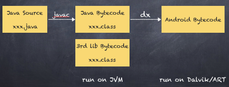
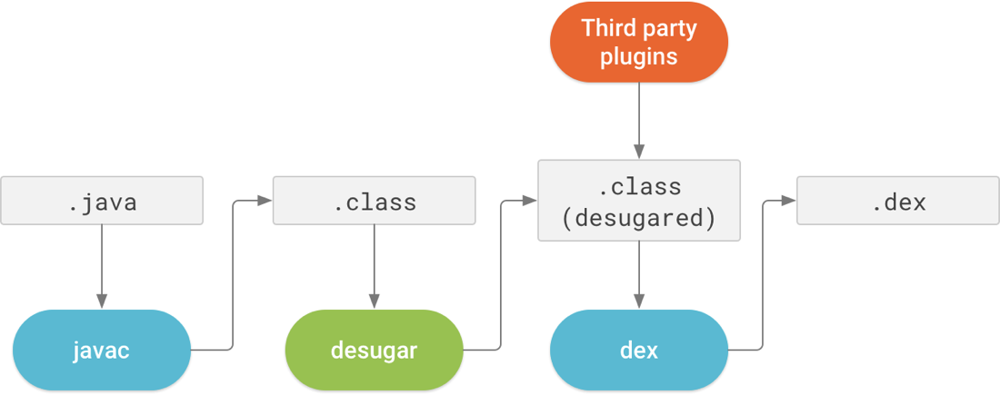

可以在 Android 原生开发中写 Lambda 了，简直不要太舒服好吧 🚀

<!---more--->


### Android and Java

Java 在 Android 的快速发展中扮演着非常重要的角色，开发语言是 Java，Framework 框架（即 Android SDK），引用了 80% 的 JDK-API，开发工具 Android Studio 是基于 Java 开发工具 IDEA 二次开发完成的，这些和 Java 都有着千丝万缕的关系

但是可能是受到与 Oracle 公司法律诉讼的影响，Google 在 Android 上针对 Java 的升级一直都不是很积极

- Java7 （2011.07）
  - Android 从1.0 一直升级到4.4，迭代了将近19个Android版本，才在4.4版本中支持了Java 7
- Java8 （2014.03）
  - RetraLambda 插件
  - 然后从 Android 4.4 版本开始算起，一直到 Android N(7.0) 共4个 Android 版本，才在 Jack/Jill 工具链勉强支持了Java 8。但由于 Jack/Jill 工具链在构建流程中舍弃了原有 Java 字节码的体系，导致大量既有的技术沉淀无法应用，致使许多 App 工程放弃了接入
  - 最后直到 Android P(9.0) 版本， Google 才在 Android Studio 3.x 中通过新增的 D8 dex 编译器正式支持了 Java 8，但部分 API 并不能全版本支持

### Java8 new features overview

Java8 是 Java 非常重要的一个版本，从这个版本开始，Java 开启支持函数式编程。也吸收了运行在JVM上的 Groovy、Scala 这种动态脚本语言的特性后，Java8 在语言的表达力、简洁性优良很大的提高

Java8 的主要语言特性改进概括起来包括以下几点：

- **Lambda expression** - Lambda 表达式
- **Method reference** - 方法直接引用，也就是函数式接口
- **Default method** - 抽象接口中允许使用 default 关键字，来定义非抽象方法
- **Repeating annotation** - 可重复使用注解
- **Stream API** - 通过流式调用支持 map、filter 等高阶函数
- **Date API** - 改进、扩展了的关于日期和时间的 API
- **New tools** - 新的工具，比如分析器、引擎（Nashorn 引擎 jjs、 类依赖分析器 jdeps）
- **Optional** - 用来解决空指针异常的 Optional 类
- **Nashorn, JavaScript Engine** - 增加了一个 JS 引擎，允许在 JVM 上运行特定的 js 程序

> 接下来我们看一下 Java8 语法特性是如何在 JVM 上工作的，以 Lambda 表达式为例

### Lambda expression

Lambda 表达式主要用来定义行内执行的方法类型接口，如一个简单的**函数式接口**，它免去了使用匿名方法的麻烦，并且给予 Java 简单但是强大的函数化编程能力，语法如下：

- `(parameters) -> expression`
- `(parameters) -> {statements;}`

> 函数式接口：Java8 对一类特殊类型接口的称呼，这类接口只定义了除了 Object 对象公共方法外的唯一的抽象方法的接口
>
> 为什么定义此接口？不想为 Lambda 表达式单独定义一种特殊的函数类型，比如箭头类型，想采用 Java 现有的类型系统，避免增加一个结构化函数类型来增加复杂性

比如我们写了这样的一个包含 Lambda 表达式的 demo：

```java
public class HelloLambda {

    public static void main(String[] args) {
        new Thread(() -> System.out.println("hello")).start();
    }

}
```

使用  `javac HelloLambda.java` 命令编译，结果如下


可以看到还是有箭头符号的，使用 `javap -c -p HelloLambda` 命令进行反汇编，结果如下


可以看到其中有一条 `invokedynamic` 调用方法指令，我们知道 JVM 中调用方法一共有五种指令，其余四种为：

- `invokestatic` - 调用静态方法
- `invokespecial` - 调用私有方法、父类方法、类构造器方法
- `invokeinterface` - 调用接口方法
- `invokevirtual` - 调用需方法（除了以上以外的方法）

这四种指令，都是在变异期间生成的 class 文件中，通过常量池 Constant Pool 的 MethodRef 常量已经固定了目标方法的符号信息（方法所属者及其类型、方法名字、参数顺序和类型、返回值），虚拟机使用符号信息能直接解释出具体的方法，直接调用

- `invokedynamic` - 动态执行方法

> 那么，`invokedynamic` 是如何通过引导方法找到所属者及其类型的呢？

使用 `javap  -v HelloLambda.class` 查看本地变量表，结果如下


对应到了常量池中这一条数据，注意常量池中的 `InvokeDynamic` 不是指令，代表的是 `Constant InvokeDynamic Info`结构，后面紧跟的 `#0` 标识的是 `BootstrapMethod` 区域中引导方法的索引：


可以发现引导方法中的  `java/lang/invoke/LambdaMetafactory.metafactory`，才是 `invokedynamic` 指令执行过程中的关键步骤，源码如下：


可以发现，执行该方法，会在内存中动态生成一个实现 Lambda 表达式对应函数式接口的实例类型，并在接口的实现方法中调用新增的静态私有方法

运行 `java -Djdk.internal.lambda.dumpProxyClasses HelloLambda.class`，将内存中动态生成的类型输出到本地（⚠️ 需要在项目根目录 src 下执行此命令）


运行 `javap -p -c HelloLambda\$\$Lambda\$1` 反编译，可以看到生成累的实现为


在 run 方法中使用了 invokestatic 指令，直接调用了 `HelloLambda.lambda\$main\$0` 这个在编译期间生成的静态私有方法

> 至此，以上就是 Lambda 表达式在 Java 底层的实现原理，那么在 Android 中，是如何处理的呢？

### Run directly on Android?

Java Bytecode, JVM 字节码，是不能直接运行在 Android 系统上的，需要转换成 Android Bytecode，也就是 Dalvik / ART 字节码



### Android support indirectly

因此 Android 进行了间接支持，在 Java 字节码转换到 Android 字节码的过程中增加一个步骤，把字节换转换为 Android 虚拟机支持的字节码，这个过程可以称为 **脱糖 (Desugar)**



无论是之前的 Jack & Jill 工具，还是现在的 D8 dex 编译器，处理方式都是类似的：在流程上，增加脱糖的过程；在原理上，参考 Lambda 在 Java 底层的实现，把这些实现移植到插件或编译器工具中

Android 中支持的 Java8 语法包括：

- Lambda expression
- Method references
- Default method
- Repeating annotation

在 D8 编译方式中，脱糖的过程放在了其内部，由 Android Studio 来实现这个转换，本质上也是参考 `java/lang/invoke/LambdaMetafactory.metafactory` 的方式将原本在运行时生成在内存中的类，在 D8 编译 dex 期间，直接生成并写入到 dex 文件中

实际开发中，保证 Android Studio 版本在 3.0 及以上，在 module 的 build.gradle 文件，在android 节点中增加如下代码后，该 module 即可完成对部分 Java8 语法特性的支持   

```shell
compileOptions {
    sourceCompatibility JavaVersion.VERSION_1_8
    targetCompatibility JavaVersion.VERSION_1_8
}
```

参考： [Google 官方指导文档](https://developer.android.com/studio/write/java8-support?hl=zh-cn)

